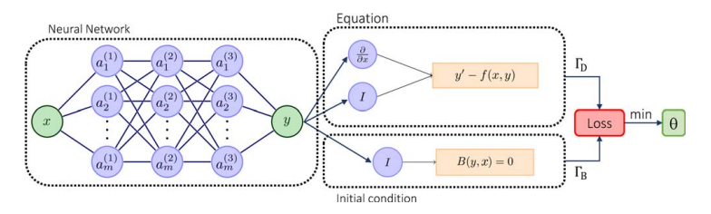
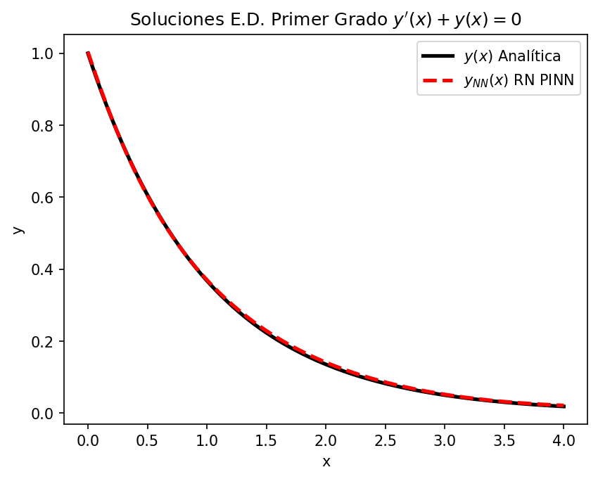
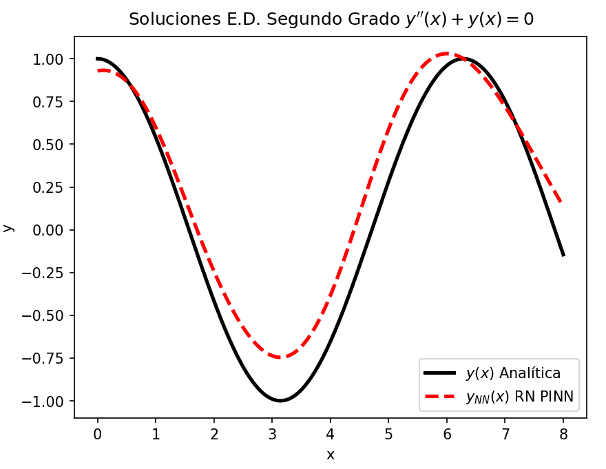

# Solución de Ecuaciones Diferenciales con Redes Neuronales PINN

# Índice

* [Redes PINN](#Redes-PINN) 

* [Ecuación Diferencial de 1er Orden](#Ecuación-Diferencial-de-1er-Orden) 

* [Ecuación Diferencial de 2do Orden](#Ecuación-Diferencial-de-2do-Orden) 

* [Autor](#Autor)

# Redes PINN

Una Red Neuronal PINN (Physics-Informed Neural Network) es un tipo de red neuronal que integra conocimientos físicos en 
su estructura de aprendizaje. A diferencia de las redes neuronales convencionales, las PINNs están diseñadas para resolver
 ecuaciones diferenciales parciales (EDP) que describen fenómenos físicos, como la dinámica de fluidos, la mecánica cuántica
  o la propagación de calor.

 De manera simplificada las redes PINN son una red neuronal común pero en su función de perdida se le agregan términos 
 relacionados de las condiciones iniciales y la ecuación diferencial a resolver. 

 La función de perdida:

 $$ Loss = \omega_{D}L_{D} + \omega_{B}L_{B} $$

 Donde: 
 - $\omega_{D}$ y $\omega_{B}$ son hiperparámetros que se escogieron como 1, para nuestro caso. 
 - $L_{D} = \frac{1}{N_{D}} \sum_{i=1}^{N_{D}} \left| Y_{NN}(X_{i} - f(X_{i})) \right|$ Término relacionado con el ajuste a la condiciones iniciales
 - $L_{B} = \left|Y_{NN}(X_{0}) - Y_{i} \right|$ Término relacionado con el ajuste a la ecuación diferencial 

Beneficios:
Incorporación de leyes físicas: Al integrar ecuaciones físicas directamente, mejora la precisión y estabilidad en la simulación 
de fenómenos físicos. Reducción de datos: No siempre requieren grandes cantidades de datos, ya que la física incorporada ayuda 
a guiar el aprendizaje. Mejor generalización: Al estar informadas por la física, tienden a generalizar mejor en problemas con 
restricciones físicas.

Usos:
Las PINNs se usan en la simulación de sistemas físicos complejos, como la ingeniería, la climatología, la medicina (simulación de flujo sanguíneo) y otros campos científicos donde resolver EDPs es fundamental.

 [Volver al Índice](#Índice)

# [Ecuación Diferencial de 1er Orden](https://github.com/jrguignan/Solucion_de_Ecuaciones_Diferenciales_con_Redes_PINN/blob/main/1er_EDO.ipynb)

$$ y'(x)+y(x)=0 \hspace{1cm} 0 \leqslant x \leqslant 4 $$ 

### Condiciones Iniciales:
$$ y(0)=1 $$

### Solución Analítica:
$$ y(x) = e^{-x} $$

# [Ecuación Diferencial de 2do Orden](https://github.com/jrguignan/Solucion_de_Ecuaciones_Diferenciales_con_Redes_PINN/blob/main/2do_EDO.ipynb)

$$ y''(x) + y(x)=0 \hspace{1cm} 0 \leqslant x \leqslant 8 $$ 

### Condiciones Iniciales:
$$ y(0)=1,\hspace{1cm} y'(0)=0 $$

### Solución Analítica:
$$ y(x)=cos(x) $$

 [Volver al Índice](#Índice)

# Autor

- José R. Guignan
- Mail: joserguignan@gmail.com
- Linkedin: [https://www.linkedin.com/in/jrguignan/](https://www.linkedin.com/in/jrguignan)
- Portafolio: [https://jrguignan.github.io/](https://jrguignan.github.io/)
